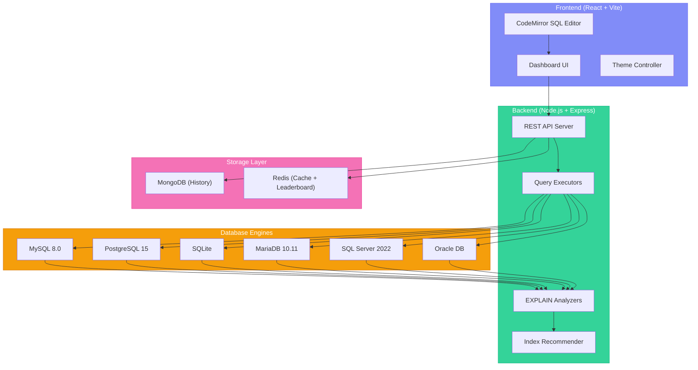
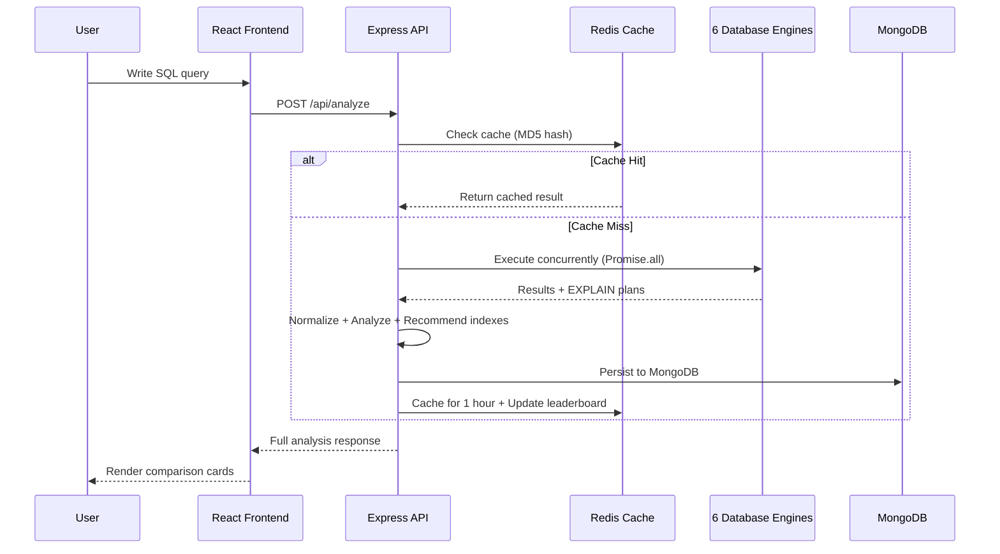

<p align="center">
  
</p>

<p align="center">
  <strong>English</strong>
</p>

<p align="center">
  
</p>

# Database Performance Observatory

**Run a single SQL query across MySQL, PostgreSQL, SQLite, MariaDB, SQL Server & Oracle — simultaneously. Compare EXPLAIN plans, get index recommendations, and track query performance over time.**

DPO is a full-stack performance benchmarking dashboard. You write SQL once; DPO executes it concurrently across every connected database engine, parses each engine's native EXPLAIN plan into a normalized format, determines the fastest engine, and recommends indexes when full table scans are detected.

- **One query, six engines** — write SQL once, see how MySQL, PostgreSQL, SQLite, MariaDB, MSSQL, and Oracle each handle it
- **EXPLAIN plan analysis** — every engine's native execution plan is parsed and normalized into scan type, rows scanned, and cost
- **Index recommendations** — automatic `CREATE INDEX` suggestions when full table scans are detected
- **Redis-powered caching** — identical queries return instantly from cache for 1 hour
- **Slow query leaderboard** — Redis Sorted Sets rank your slowest queries in real time
- **Query history** — every analysis is persisted in MongoDB with full comparison metadata


---

## See DPO in action

> Same dashboard, two themes, one click to switch:

| Dark | Light |
|---|---|
|  |  |

| SQL Editor with CodeMirror | Engine Comparison Cards | Slow Query Leaderboard |
|---|---|---|
| Write SQL with syntax highlighting, autocomplete, and dark mode support. | See execution time, scan strategy, and rows scanned for each engine side-by-side. | Redis-ranked bottleneck view shows your slowest queries with rank ribbons. |

---

## Preview

### Winner Banner
When analysis completes, DPO highlights which engine won the race and by how much:

```
┌─────────────────────────────────────────────────────────┐
│  🏆  PostgreSQL won the race!                           │
│  Executed 3.2x faster than the closest competitor.      │
└─────────────────────────────────────────────────────────┘
```

### Optimization Insights
When a full table scan is detected, DPO generates actionable index recommendations:

```sql
-- MySQL Hint
CREATE INDEX idx_products_category ON products(category);

-- PostgreSQL Hint
CREATE INDEX idx_products_category ON products(category);
```

---

## Architecture



---

## Tech Stack

### Backend
| Technology | Purpose |
|---|---|
| **Node.js** | Runtime environment |
| **Express.js** | REST API framework |
| **mysql2** | MySQL driver |
| **pg** | PostgreSQL driver |
| **sqlite3** | SQLite driver (embedded) |
| **mariadb** | MariaDB driver |
| **mssql** | SQL Server driver |
| **oracledb** | Oracle DB driver |
| **mongoose** | MongoDB ODM for query history |
| **redis** | Caching & sorted set leaderboard |
| **dotenv** | Environment configuration |
| **crypto** | MD5 query hashing |

### Frontend
| Technology | Purpose |
|---|---|
| **React 19** | UI library |
| **Vite** | Build tool & dev server |
| **Tailwind CSS 4** | Utility-first styling |
| **CodeMirror** | SQL editor with syntax highlighting |
| **Axios** | HTTP client |
| **Lucide React** | Icon system |
| **PostCSS** | CSS processing |

### Infrastructure
| Technology | Purpose |
|---|---|
| **Docker** | Container runtime |
| **Docker Compose** | Multi-container orchestration |
| **MongoDB** | Query history persistence |
| **Redis** | Result caching + slow query ranking |

---

## Quick Start

### 1. Clone

```bash
git clone https://github.com/aryangup451-del/Database-Performance-Observatory.git
cd Database-Performance-Observatory
```

### 2. Start databases with Docker

```bash
# Core databases (MySQL, PostgreSQL, MariaDB, MSSQL, MongoDB, Redis)
docker-compose up -d

# Optional: Enterprise databases (Oracle, DB2) — requires 12+ GB RAM
docker-compose -f docker-compose.enterprise.yml up -d
```

### 3. Seed test data

```bash
cd seeder
npm install
node seed.js
```

### 4. Start the backend

```bash
cd backend
npm install
node src/index.js
```

### 5. Start the frontend

```bash
cd frontend
npm install
npm run dev
```

### 6. Open in browser

```
http://localhost:5173
```

Then write any SQL query and click **Run Analysis** to race it across all engines.

---

## API Reference

| Method | Endpoint | Description |
|---|---|---|
| `POST` | `/api/analyze` | Execute a SQL query across all engines, return normalized EXPLAIN plans, comparison, and index recommendations |
| `GET` | `/api/history` | Fetch the last 50 analyzed queries from MongoDB |
| `GET` | `/api/leaderboard` | Fetch the top 10 slowest queries from Redis Sorted Set |
| `GET` | `/api/trends` | Aggregate which database engine wins most often |

### Example Request

```bash
curl -X POST http://localhost:3001/api/analyze \
  -H "Content-Type: application/json" \
  -d '{"query": "SELECT * FROM products WHERE category = '\''Electronics'\''"}'
```

### Example Response

```json
{
  "query_text": "SELECT * FROM products WHERE category = 'Electronics'",
  "query_hash": "a1b2c3d4e5f6...",
  "results": {
    "mysql":      { "execution_time_ms": 12.5, "scan_type": "Full Table Scan", "rows_scanned": 5000 },
    "postgresql": { "execution_time_ms": 8.3,  "scan_type": "Sequential Scan", "rows_scanned": 5000 },
    "sqlite":     { "execution_time_ms": 3.1,  "scan_type": "SCAN TABLE",      "rows_scanned": 5000 },
    "mariadb":    { "execution_time_ms": 11.2, "scan_type": "Full Table Scan", "rows_scanned": 5000 },
    "mssql":      { "execution_time_ms": 15.7, "scan_type": "Table Scan",      "rows_scanned": 5000 },
    "oracle":     { "execution_time_ms": 9.8,  "scan_type": "TABLE ACCESS FULL","rows_scanned": 5000 }
  },
  "comparison": { "faster_db": "sqlite", "speed_ratio": 2.67 },
  "recommendations": [
    {
      "type": "create_index",
      "database": "mysql",
      "suggestion": "CREATE INDEX idx_products_category ON products(category);"
    }
  ]
}
```

---

## Project Structure

```
Database-Performance-Observatory/
├── backend/
│   ├── src/
│   │   ├── analyzers/           # EXPLAIN plan parsers per engine
│   │   │   ├── mysqlAnalyzer.js
│   │   │   ├── postgresAnalyzer.js
│   │   │   ├── sqliteAnalyzer.js
│   │   │   ├── mariadbAnalyzer.js
│   │   │   ├── mssqlAnalyzer.js
│   │   │   └── oracleAnalyzer.js
│   │   ├── executors/           # Query runners per engine
│   │   │   ├── mysqlExecutor.js
│   │   │   ├── postgresExecutor.js
│   │   │   ├── sqliteExecutor.js
│   │   │   ├── mariadbExecutor.js
│   │   │   ├── mssqlExecutor.js
│   │   │   └── oracleExecutor.js
│   │   ├── recommenders/        # Index recommendation engine
│   │   │   └── indexRecommender.js
│   │   ├── models/              # MongoDB schemas
│   │   │   └── QueryAnalysis.js
│   │   └── index.js             # Express server entry point
│   ├── sqlite.db                # Embedded SQLite database
│   └── package.json
├── frontend/
│   ├── src/
│   │   ├── App.jsx              # Main dashboard component
│   │   ├── main.jsx             # React entry point
│   │   └── index.css            # Tailwind imports
│   ├── tailwind.config.js
│   ├── vite.config.js
│   └── package.json
├── database-init/
│   ├── mysql/                   # MySQL init scripts
│   └── postgres/                # PostgreSQL init scripts
├── seeder/
│   └── seed.js                  # Faker.js data generator (5000 products)
├── docker-compose.yml           # Core services
├── docker-compose.enterprise.yml # Oracle + DB2
└── README.md
```

---

## How It Works



1. **Query Input** — User writes SQL in the CodeMirror editor
2. **Safety Check** — Backend validates only `SELECT` / `WITH` / `EXPLAIN` queries are allowed
3. **Cache Lookup** — MD5 hash of the query is checked against Redis
4. **Concurrent Execution** — `Promise.all()` runs the query across all 6 engines simultaneously
5. **EXPLAIN Parsing** — Each engine's native execution plan is parsed into normalized metrics
6. **Winner Detection** — Fastest engine is identified with speed ratio calculation
7. **Index Recommendation** — Full table scans trigger automatic `CREATE INDEX` suggestions
8. **Persistence** — Results saved to MongoDB, cached in Redis, and ranked in the leaderboard

---

## Environment Variables

Create a `.env` file in the `backend/` directory:

```env
# MongoDB
MONGO_URI=mongodb://localhost:27017/dpo

# Redis
REDIS_URL=redis://localhost:6379

# MySQL
MYSQL_HOST=127.0.0.1
MYSQL_PORT=3307
MYSQL_USER=dpo_readonly
MYSQL_PASSWORD=readonly_password
MYSQL_DATABASE=dpo

# PostgreSQL
PG_HOST=127.0.0.1
PG_PORT=5432
PG_USER=dpo_readonly
PG_PASSWORD=readonly_password
PG_DATABASE=dpo

# MariaDB
MARIADB_HOST=127.0.0.1
MARIADB_PORT=3308
MARIADB_USER=dpo_readonly
MARIADB_PASSWORD=readonly_password
MARIADB_DATABASE=dpo

# SQL Server
MSSQL_HOST=127.0.0.1
MSSQL_PORT=1433
MSSQL_USER=sa
MSSQL_PASSWORD=SuperStrongP@ssw0rd!
MSSQL_DATABASE=master

# Oracle (Enterprise)
ORACLE_HOST=127.0.0.1
ORACLE_PORT=1521
ORACLE_USER=system
ORACLE_PASSWORD=readonly_password
ORACLE_DATABASE=FREEPDB1

# Server
PORT=3001
```

---

## Roadmap

- [x] MySQL + PostgreSQL core comparison
- [x] SQLite embedded engine
- [x] MariaDB support
- [x] Microsoft SQL Server support
- [x] Oracle DB support
- [x] Redis caching layer
- [x] Slow query leaderboard (Redis ZSET)
- [x] MongoDB query history
- [x] Dark / Light theme toggle
- [x] CodeMirror SQL editor
- [x] Index recommendation engine
- [ ] IBM DB2 support
- [ ] Google Cloud SQL support
- [ ] Snowflake support
- [ ] Visual EXPLAIN plan tree rendering
- [ ] Query diff — compare two queries side-by-side
- [ ] Export results as PDF / CSV
- [ ] User authentication & saved workspaces
- [ ] CI/CD pipeline with GitHub Actions

---

## Contributing

Contributions are welcome! Here's how:

1. **Fork** the repository
2. **Create** a feature branch (`git checkout -b feature/amazing-feature`)
3. **Commit** your changes (`git commit -m 'Add amazing feature'`)
4. **Push** to the branch (`git push origin feature/amazing-feature`)
5. **Open** a Pull Request

Please make sure your code follows the existing patterns (Executor/Analyzer per engine).

---

## License

This project is licensed under the **MIT License** — see the [LICENSE](LICENSE) file for details.

---

<p align="center">
  <strong>Built with ❤️ by <a href="https://github.com/aryangup451-del">Aryan Gupta</a></strong>
</p>

<p align="center">
  <a href="https://github.com/aryangup451-del/Database-Performance-Observatory/stargazers">⭐ Star this repo</a> · 
  <a href="https://github.com/aryangup451-del/Database-Performance-Observatory/issues">🐛 Report Bug</a> · 
  <a href="https://github.com/aryangup451-del/Database-Performance-Observatory/issues">✨ Request Feature</a>
</p>
